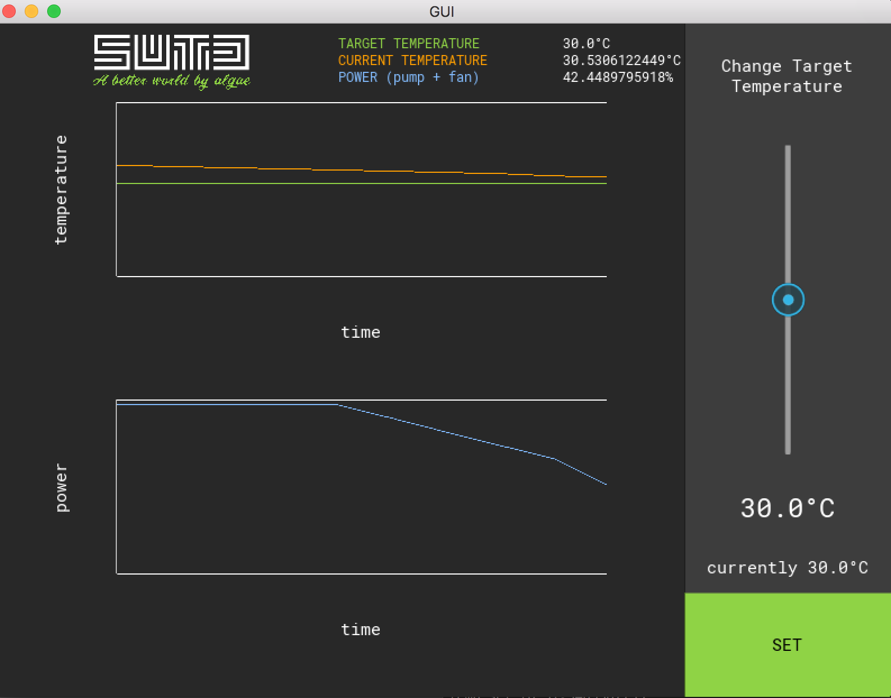

# Usage
1. Add the database URL and secrets to your environment variables (ask me for them. We don't want random people messing with our DB!)
2. Install the graph widget from kivy garden (in terminal, enter `garden install graph`)
3. Tuh-duh

